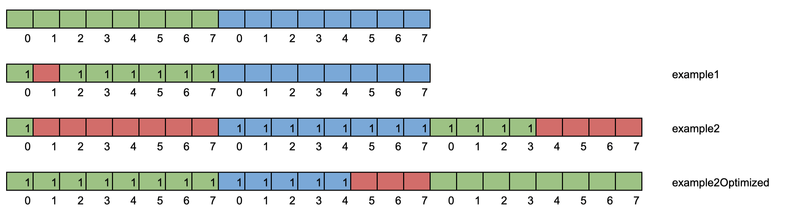

# Struct Memory Allocation

Video: https://www.youtube.com/watch?v=0c1RMy7GDHU 

Ref:
- https://itnext.io/structure-size-optimization-in-golang-alignment-padding-more-effective-memory-layout-linters-fffdcba27c61
- https://perennialsky.medium.com/memory-allocation-for-a-struct-in-golang-b5057b8ccf23
- https://github.com/ardanlabs/gotraining/blob/master/topics/go/language/struct_types/README.md
